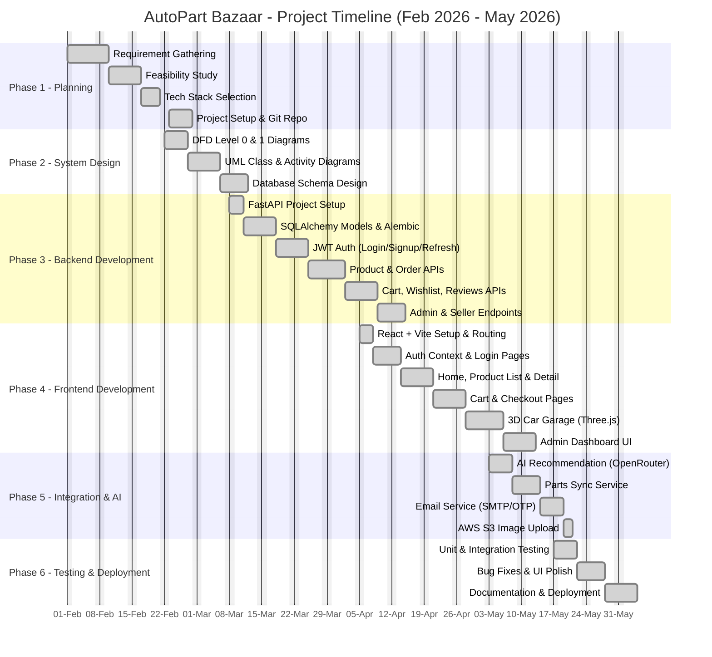

# Gantt Chart - AutoPart Bazaar Project Timeline

## Project Duration: February 2026 - May 2026 (4 Months / 16 Weeks)

This document presents the complete project timeline for **AutoPart Bazaar** - a full-stack auto-parts marketplace with 3D car visualization and AI-powered recommendations.

---

## 1. High-Level Phase Overview

| Phase | Duration | Period | Status |
|-------|----------|--------|--------|
| Phase 1: Planning & Analysis | 3 Weeks | Feb 01 - Feb 21 | Completed |
| Phase 2: System Design | 2 Weeks | Feb 22 - Mar 07 | Completed |
| Phase 3: Backend Development | 4 Weeks | Mar 08 - Apr 04 | Completed |
| Phase 4: Frontend Development | 4 Weeks | Apr 05 - May 02 | Completed |
| Phase 5: Integration & AI Module | 2 Weeks | May 03 - May 16 | Completed |
| Phase 6: Testing & Deployment | 2 Weeks | May 17 - May 31 | Completed |

---

## 2. Mermaid Gantt Chart (Visual Timeline)



---

## 3. Detailed Week-by-Week Breakdown

### FEBRUARY 2026 - Planning & Design Phase

#### Week 1 (Feb 01 - Feb 07): Requirement Gathering
- Stakeholder interviews and user role identification (Customer, Seller, Store Manager, Admin)
- Functional requirements documentation
- Non-functional requirements (security, performance, scalability)
- Defined scope: marketplace + 3D car visualization + AI recommendations

#### Week 2 (Feb 08 - Feb 14): Feasibility Study & Tech Selection
- Tech stack evaluation: React vs Next.js, FastAPI vs Django
- Database choice: PostgreSQL with async SQLAlchemy
- Decision: AWS S3 for image storage, OpenRouter Gemma for AI
- Tool selection: VS Code, GitHub, Postman, Three.js

#### Week 3 (Feb 15 - Feb 21): Project Setup
- GitHub repository created
- Project folder structure (frontend/, backend/, scripts/)
- Initial package.json, requirements.txt, .env.example
- Development environment setup on team machines

#### Week 4 (Feb 22 - Feb 28): System Design - Diagrams
- DFD Level 0 (Context Diagram) - external entities and system boundaries
- DFD Level 1 - process decomposition
- UML Class Diagram - entities and relationships
- UML Activity Diagram - user workflows

---

### MARCH 2026 - Backend Development Phase

#### Week 5 (Mar 01 - Mar 07): Database Schema
- Designed tables: Users, Products, Orders, OrderItems, Reviews, Wishlist, CarModels, Garage, SavedBuilds, AIEvents
- Defined foreign keys, indexes, and constraints
- Alembic migration scripts (001 through 007)

#### Week 6 (Mar 08 - Mar 14): FastAPI + Models
- FastAPI project initialized with `main.py`, `config.py`
- SQLAlchemy async models created in `backend/models/`
- Pydantic schemas in `backend/schemas/`
- CORS, rate limiting middleware configured

#### Week 7 (Mar 15 - Mar 21): Authentication System
- JWT token generation and validation
- `routers/auth.py` - signup, login, refresh endpoints
- Password hashing with bcrypt
- Silent token refresh mechanism
- Password reset flow with OTP

#### Week 8 (Mar 22 - Mar 28): Product & Order APIs
- `routers/products.py` - CRUD for products, filtering, search
- `routers/orders.py` - place order, view history, status updates
- `routers/car_models.py` - car model catalog APIs
- Order email confirmation integration

---

### APRIL 2026 - Frontend Development Phase

#### Week 9 (Mar 29 - Apr 04): Cart, Wishlist, Reviews APIs
- `routers/cart.py`, `routers/wishlist.py`, `routers/reviews.py`
- Admin & Seller scoped endpoints
- `routers/admin_sync.py` for parts sync trigger
- Backend API testing via Postman

#### Week 10 (Apr 05 - Apr 11): React Frontend Setup
- Vite + React + TailwindCSS configured
- React Router setup with protected routes
- `AuthContext`, `CartContext`, `ThemeContext` created
- Axios instance with JWT interceptors

#### Week 11 (Apr 12 - Apr 18): Core Pages
- Home page with featured products
- ProductList and ProductDetail pages
- Login, Signup, ForgotPassword pages
- Reusable UI components (Navbar, Footer, ProductCard, Button)

#### Week 12 (Apr 19 - Apr 25): Cart, Checkout & User Pages
- Cart page with quantity management
- Checkout flow with address forms
- OrderConfirmation page
- UserProfile, Order history pages

---

### MAY 2026 - Advanced Features, Integration & Testing

#### Week 13 (Apr 26 - May 02): 3D Garage & Admin Dashboard
- Three.js integration in `ViewModel.jsx` and `Garage.jsx`
- GLB model loading (Honda Civic, Toyota Corolla, Hilux)
- Car customization controls (color, wheels, parts)
- Admin Dashboard with product/order management

#### Week 14 (May 03 - May 09): AI Module Integration
- `routers/car_ai.py` - OpenRouter Gemma API integration
- `services/ai_service.py` for prompt building
- `useCarAI` hook on frontend
- `AIModPanel` component for recommendations
- AI event tracking (`models/ai_event.py`)

#### Week 15 (May 10 - May 16): External Services
- Parts Sync Service - fetches from remote feeds, upserts products
- Email service - order confirmations, OTP delivery
- AWS S3 image upload (with local fallback)
- SavedBuilds feature for car customizations

#### Week 16 (May 17 - May 23): Testing
- Unit tests for backend services (pytest)
- API endpoint integration tests
- Frontend component testing (Jest)
- Manual UAT with all user roles
- Load testing with Apache JMeter

#### Week 17 (May 24 - May 31): Final Polish & Deployment
- Bug fixes from testing phase
- UI/UX polish and responsive design fixes
- Final documentation (README, Implementation Phase, Testing Strategy)
- Production deployment and smoke testing

---

## 4. Module Delivery Timeline

| Module | Start Date | End Date | Duration |
|--------|-----------|----------|----------|
| Authentication & User Management | Mar 15 | Mar 21 | 1 week |
| Product Catalog | Mar 22 | Apr 04 | 2 weeks |
| Cart & Checkout | Mar 29 | Apr 25 | 4 weeks |
| 3D Car Garage | Apr 26 | May 02 | 1 week |
| AI Recommendation Engine | May 03 | May 09 | 1 week |
| Admin Dashboard | Apr 26 | May 02 | 1 week |
| Parts Sync Service | May 10 | May 16 | 1 week |
| Email & S3 Integration | May 10 | May 16 | 1 week |
| Testing & QA | May 17 | May 23 | 1 week |
| Deployment | May 24 | May 31 | 1 week |

---

## 5. Key Milestones

| Milestone | Date | Deliverable |
|-----------|------|-------------|
| M1: Requirements Frozen | Feb 21 | SRS document approved |
| M2: Design Complete | Mar 07 | DFD, UML, DB schema finalized |
| M3: Backend MVP | Apr 04 | All REST APIs functional |
| M4: Frontend MVP | May 02 | All pages built and connected |
| M5: AI Integration Complete | May 09 | AI recommendations live |
| M6: Production Ready | May 31 | Deployed and tested |

---

## 6. Resource Allocation (Effort Distribution)

```
Planning & Design   : ████████░░░░░░░░░░░░░░░░░░░░░░░░  20%
Backend Development : ███████████░░░░░░░░░░░░░░░░░░░░░  28%
Frontend Development: ███████████░░░░░░░░░░░░░░░░░░░░░  28%
Integration & AI    : ██████░░░░░░░░░░░░░░░░░░░░░░░░░░  14%
Testing & Deployment: ████░░░░░░░░░░░░░░░░░░░░░░░░░░░░  10%
```

---

## 7. Critical Path

The critical path (longest dependency chain) runs through:

```
Requirements → DB Schema → Backend APIs → Frontend Integration → AI Module → Testing → Deployment
   (3 wks)      (1 wk)       (4 wks)         (4 wks)            (1 wk)     (1 wk)    (1 wk)
```

**Total Critical Path Duration: 15 weeks** (with 1 week buffer for risk mitigation)

---

## 8. Risk Mitigation Schedule

| Risk | Mitigation Window | Status |
|------|-------------------|--------|
| Three.js learning curve | Apr 26 - May 02 (added buffer) | Resolved |
| AI API rate limits | May 03 - May 09 (caching added) | Resolved |
| Async DB performance | Mar 08 - Mar 14 (early optimization) | Resolved |
| Frontend-Backend integration | Continuous from Apr 05 | Resolved |

---

*Document Version: 1.0 | Last Updated: May 31, 2026*
