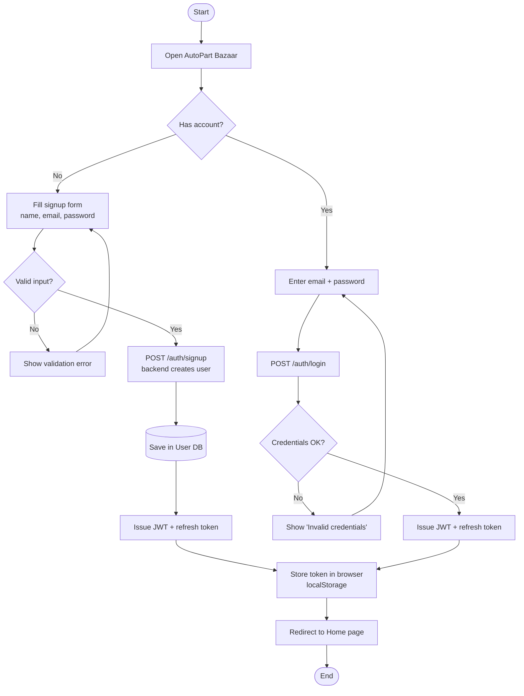
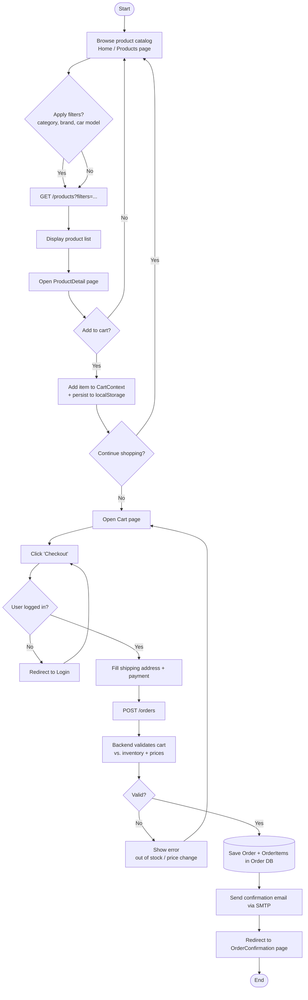
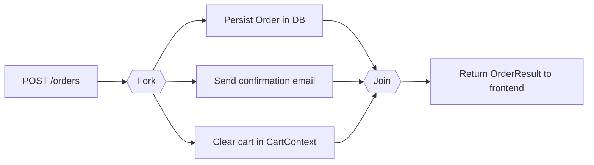
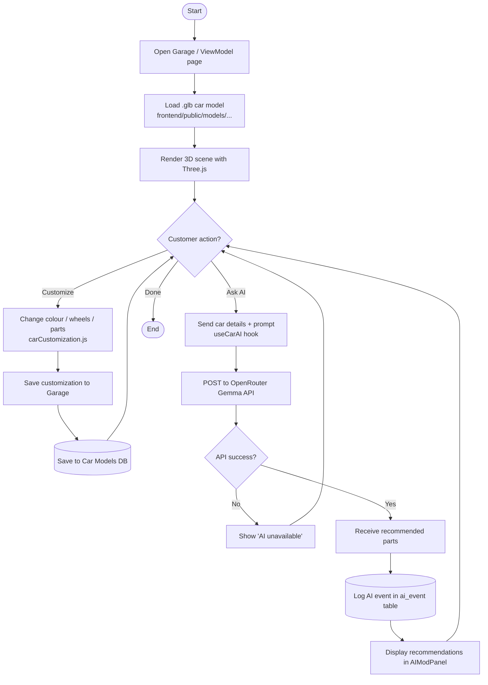
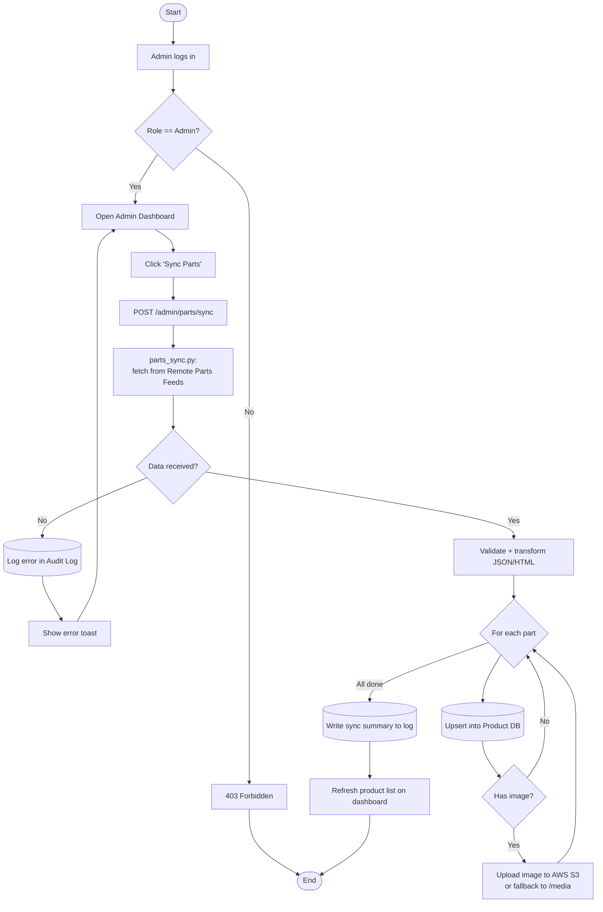

# 3.4.2: UML Activity Diagrams - AutoPart Bazaar

## What is an Activity Diagram?

An **Activity Diagram** is a UML *behavioral* diagram that shows the
**flow of control** through a system — the sequence of actions, decisions,
parallel paths and end states that occur while a user (or another system)
completes a task.

Key notation used below:

- `( )` rounded node = **Start / End**
- `[ ]` rectangle = **Action / Activity**
- `{ }` diamond = **Decision (branch)**
- `==` horizontal bar = **Fork / Join (parallel flow)**
- Swimlanes group actions by the **actor** that performs them
  (Customer, Frontend, Backend API, External Service).

The diagrams below cover the four main end-to-end flows of AutoPart Bazaar.

---

## 1. User Authentication Flow (Signup / Login / JWT refresh)

**Notes**

- Forgot-password OTP is sent via SMTP (`email_service.py`); the flow
  returns a 503 if SMTP credentials are not configured.
- A silent refresh runs in the background whenever the JWT is close to
  expiring, so the user is not logged out mid-session.

---

## 2. Browse → Cart → Checkout → Order

**Parallel sub-flow inside checkout** (fork/join):

---

## 3. 3D Garage + AI Recommendation Flow

---

## 4. Admin: Parts Synchronization Flow

---

## Summary of Actors and Their Activities

| Actor | Main activities covered above |
|---|---|
| **Guest / Customer** | Signup, login, browse, cart, checkout, garage, ask AI |
| **Frontend (React + Vite)** | Form handling, CartContext, 3D rendering, token storage |
| **Backend (FastAPI)** | Auth, order processing, parts sync, AI proxying, email |
| **External services** | AWS S3, SMTP server, OpenRouter Gemma API, Remote Parts Feeds |
| **Admin** | Trigger parts sync, manage users, monitor sync logs |

These activity diagrams complement the
[Class Diagram](UML_ClassDiagram_AutoPartBazaar.md) (structure) and the
[DFD Level 1](DFD_Level1_AutoPartBazaar.md) (data flow) by showing the
**control flow** — the order in which the system's actions actually happen.
