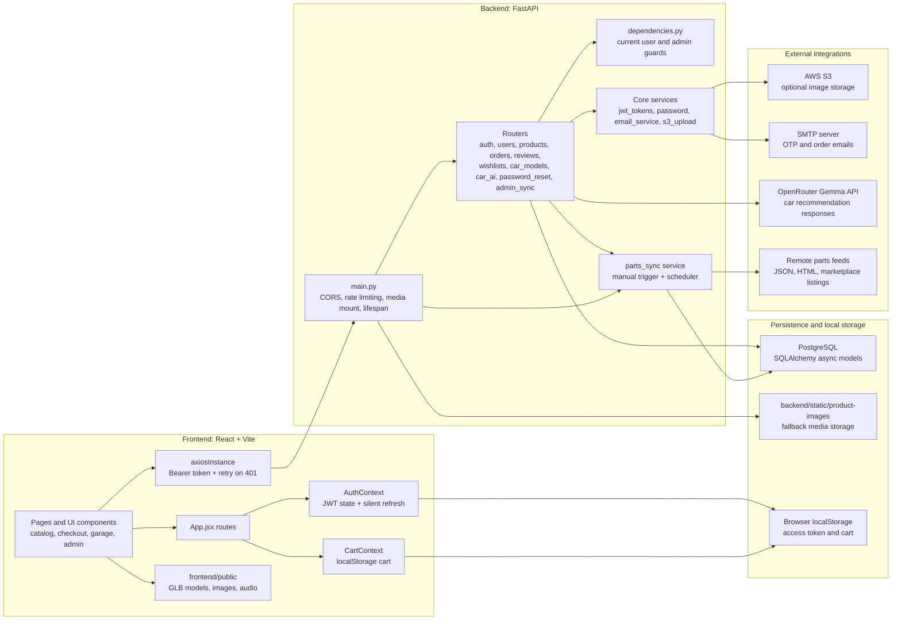

# Architecture Diagram

High-level architecture of the active React frontend and FastAPI backend in this repository.

```mermaid
flowchart LR
    subgraph FE["Frontend: React + Vite"]
        App["App.jsx routes"]
        Auth["AuthContext<br/>JWT state + silent refresh"]
        Cart["CartContext<br/>localStorage cart"]
        UI["Pages and UI components<br/>catalog, checkout, garage, admin"]
        Axios["axiosInstance<br/>Bearer token + retry on 401"]
        Assets["frontend/public<br/>GLB models, images, audio"]
    end

    subgraph BE["Backend: FastAPI"]
        Main["main.py<br/>CORS, rate limiting, media mount, lifespan"]
        Routers["Routers<br/>auth, users, products, orders, reviews,<br/>wishlists, car_models, car_ai, password_reset, admin_sync"]
        Guards["dependencies.py<br/>current user and admin guards"]
        Core["Core services<br/>jwt_tokens, password, email_service, s3_upload"]
        Sync["parts_sync service<br/>manual trigger + scheduler"]
    end

    subgraph DATA["Persistence and local storage"]
        DB["PostgreSQL<br/>SQLAlchemy async models"]
        Media["backend/static/product-images<br/>fallback media storage"]
        BrowserStore["Browser localStorage<br/>access token and cart"]
    end

    subgraph EXT["External integrations"]
        S3["AWS S3<br/>optional image storage"]
        SMTP["SMTP server<br/>OTP and order emails"]
        AI["OpenRouter Gemma API<br/>car recommendation responses"]
        Feed["Remote parts feeds<br/>JSON, HTML, marketplace listings"]
    end

    UI --> App
    App --> Auth
    App --> Cart
    UI --> Axios
    UI --> Assets
    Auth --> BrowserStore
    Cart --> BrowserStore

    Axios --> Main
    Main --> Routers
    Routers --> Guards
    Routers --> DB
    Routers --> Core
    Routers --> Sync
    Main --> Sync
    Main --> Media

    Core --> S3
    Core --> SMTP
    Routers --> AI
    Sync --> Feed
    Sync --> DB
```
