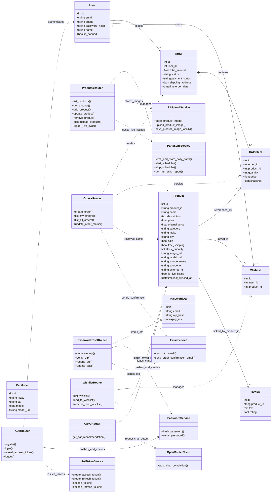

# Class Diagram

Core backend domain objects and the main router-service dependencies in the current AutoPart Bazaar codebase.

```mermaid
classDiagram
direction LR

class User {
  +int id
  +string email
  +string phone
  +string password_hash
  +string name
  +bool is_banned
}

class Product {
  +int id
  +string product_id
  +string name
  +text description
  +float price
  +float original_price
  +string category
  +string make
  +string city
  +bool sale
  +bool free_shipping
  +int stock_quantity
  +string image_url
  +string model_url
  +string source_name
  +string source_url
  +string external_id
  +bool is_live_listing
  +datetime last_synced_at
}

class Order {
  +int id
  +int user_id
  +float total_amount
  +string status
  +string payment_status
  +json shipping_address
  +datetime order_date
}

class OrderItem {
  +int id
  +int order_id
  +int product_id
  +int quantity
  +float price
  +json snapshot
}

class Review {
  +int id
  +string product_id
  +text text
  +float rating
}

class CarModel {
  +int id
  +string make
  +string car
  +float model
  +string model_url
}

class PasswordOtp {
  +int id
  +string email
  +string otp_hash
  +int expiry_ms
}

class Wishlist {
  +int id
  +int user_id
  +int product_id
}

class AuthRouter {
  +register()
  +login()
  +refresh_access_token()
  +logout()
}

class ProductsRouter {
  +list_products()
  +get_product()
  +add_product()
  +update_product()
  +remove_product()
  +bulk_upload_products()
  +trigger_live_sync()
}

class OrdersRouter {
  +create_order()
  +list_my_orders()
  +list_all_orders()
  +update_order_status()
}

class PasswordResetRouter {
  +generate_otp()
  +verify_otp()
  +resend_otp()
  +update_pass()
}

class WishlistRouter {
  +get_wishlist()
  +add_to_wishlist()
  +remove_from_wishlist()
}

class CarAIRouter {
  +get_car_recommendation()
}

class JwtTokenService {
  +create_access_token()
  +create_refresh_token()
  +decode_token()
  +decode_refresh_token()
}

class PasswordService {
  +hash_password()
  +verify_password()
}

class EmailService {
  +send_otp_email()
  +send_order_confirmation_email()
}

class S3UploadService {
  +store_product_image()
  +upload_product_image()
  +save_product_image_locally()
}

class PartsSyncService {
  +fetch_and_store_daily_parts()
  +start_scheduler()
  +stop_scheduler()
  +get_last_sync_report()
}

class OpenRouterClient {
  +post_chat_completion()
}

User "1" --> "0..*" Order : places
Order "1" *-- "1..*" OrderItem : contains
Product "1" --> "0..*" OrderItem : referenced_by
User "1" --> "0..*" Wishlist : owns
Product "1" --> "0..*" Wishlist : saved_in
Product "1" --> "0..*" Review : linked_by_product_id

AuthRouter ..> User : authenticates
AuthRouter ..> PasswordService : hashes_and_verifies
AuthRouter ..> JwtTokenService : issues_tokens

ProductsRouter ..> Product : manages
ProductsRouter ..> S3UploadService : stores_images
ProductsRouter ..> PartsSyncService : syncs_live_listings

OrdersRouter ..> Order : creates
OrdersRouter ..> OrderItem : persists
OrdersRouter ..> Product : resolves_items
OrdersRouter ..> EmailService : sends_confirmation

PasswordResetRouter ..> PasswordOtp : stores_otp
PasswordResetRouter ..> PasswordService : hashes_and_verifies
PasswordResetRouter ..> EmailService : sends_otp

WishlistRouter ..> Wishlist : manages
WishlistRouter ..> Product : loads_saved_products

CarAIRouter ..> Product : loads_candidates
CarAIRouter ..> OpenRouterClient : requests_ai_output
```
