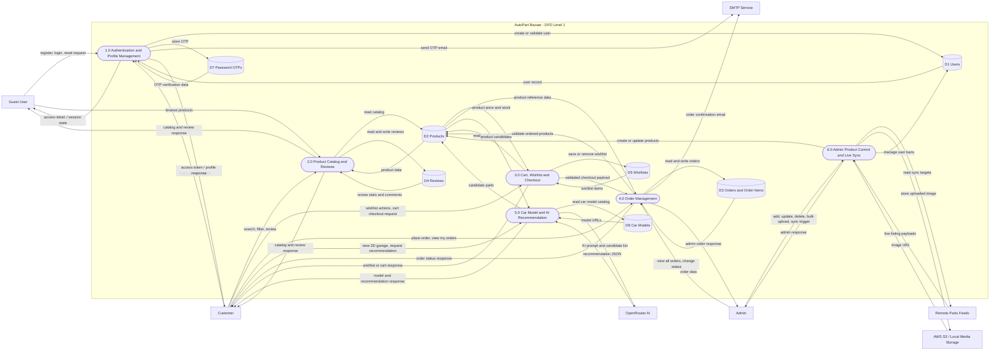

# DFD Level 1

AutoPart Bazaar ka high-level data flow diagram. Mermaid mein DFD ko `flowchart` style se represent kiya gaya hai.

```mermaid
flowchart LR
    Guest[Guest User]
    Customer[Customer]
    Admin[Admin]
    SMTP[SMTP Service]
    Media[AWS S3 / Local Media Storage]
    AI[OpenRouter AI]
    Feed[Remote Parts Feeds]

    subgraph System["AutoPart Bazaar - DFD Level 1"]
        P1([1.0 Authentication and Profile Management])
        P2([2.0 Product Catalog and Reviews])
        P3([3.0 Cart, Wishlist and Checkout])
        P4([4.0 Order Management])
        P5([5.0 Car Model and AI Recommendation])
        P6([6.0 Admin Product Control and Live Sync])

        D1[(D1 Users)]
        D2[(D2 Products)]
        D3[(D3 Orders and Order Items)]
        D4[(D4 Reviews)]
        D5[(D5 Wishlists)]
        D6[(D6 Car Models)]
        D7[(D7 Password OTPs)]
    end

    Guest -->|register, login, reset request| P1
    Customer -->|login, profile update| P1
    P1 -->|create or validate user| D1
    D1 -->|user record| P1
    P1 -->|store OTP| D7
    D7 -->|OTP verification data| P1
    P1 -->|send OTP email| SMTP
    P1 -->|access token / session state| Guest
    P1 -->|access token / profile response| Customer

    Guest -->|browse products| P2
    Customer -->|search, filter, review| P2
    P2 -->|read catalog| D2
    D2 -->|product data| P2
    P2 -->|read and write reviews| D4
    D4 -->|review stats and comments| P2
    P2 -->|catalog and review response| Guest
    P2 -->|catalog and review response| Customer

    Customer -->|wishlist actions, cart checkout request| P3
    P3 -->|read products for cart| D2
    D2 -->|product price and stock| P3
    P3 -->|save or remove wishlist| D5
    D5 -->|wishlist items| P3
    P3 -->|validated checkout payload| P4
    P3 -->|wishlist or cart response| Customer

    Customer -->|place order, view my orders| P4
    Admin -->|view all orders, change status| P4
    P4 -->|read and write orders| D3
    D3 -->|order data| P4
    P4 -->|validate ordered products| D2
    D2 -->|product reference data| P4
    P4 -->|order confirmation email| SMTP
    P4 -->|order status response| Customer
    P4 -->|admin order response| Admin

    Customer -->|view 3D garage, request recommendation| P5
    P5 -->|read car model catalog| D6
    D6 -->|model URLs| P5
    P5 -->|candidate parts| D2
    D2 -->|product candidates| P5
    P5 -->|AI prompt and candidate list| AI
    AI -->|recommendation JSON| P5
    P5 -->|model and recommendation response| Customer

    Admin -->|add, update, delete, bulk upload, sync trigger| P6
    P6 -->|create or update products| D2
    P6 -->|read sync targets| Feed
    Feed -->|live listing payloads| P6
    P6 -->|store uploaded image| Media
    Media -->|image URL| P6
    P6 -->|manage user bans| D1
    P6 -->|admin response| Admin
```
