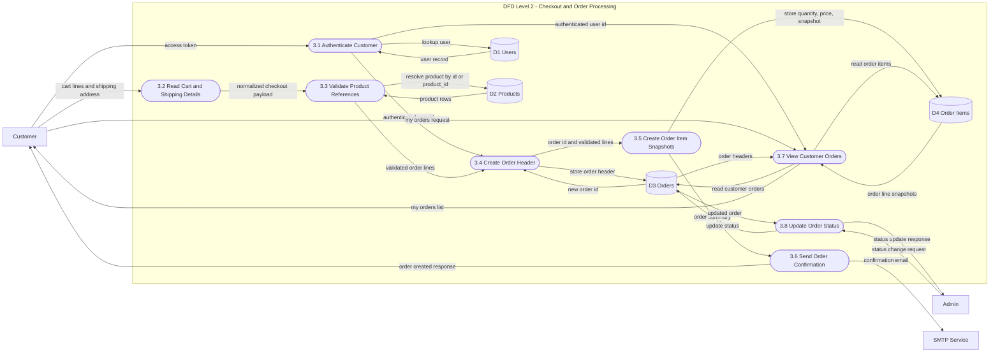

# DFD Level 2

AutoPart Bazaar ke checkout aur order processing module ka detailed data flow diagram.

```mermaid
flowchart LR
    Customer[Customer]
    Admin[Admin]
    SMTP[SMTP Service]

    subgraph OrderModule["DFD Level 2 - Checkout and Order Processing"]
        P31([3.1 Authenticate Customer])
        P32([3.2 Read Cart and Shipping Details])
        P33([3.3 Validate Product References])
        P34([3.4 Create Order Header])
        P35([3.5 Create Order Item Snapshots])
        P36([3.6 Send Order Confirmation])
        P37([3.7 View Customer Orders])
        P38([3.8 Update Order Status])

        D1[(D1 Users)]
        D2[(D2 Products)]
        D3[(D3 Orders)]
        D4[(D4 Order Items)]
    end

    Customer -->|access token| P31
    P31 -->|lookup user| D1
    D1 -->|user record| P31
    P31 -->|authenticated user id| P34
    P31 -->|authenticated user id| P37

    Customer -->|cart lines and shipping address| P32
    P32 -->|normalized checkout payload| P33

    P33 -->|resolve product by id or product_id| D2
    D2 -->|product rows| P33
    P33 -->|validated order lines| P34

    P34 -->|store order header| D3
    D3 -->|new order id| P34
    P34 -->|order id and validated lines| P35

    P35 -->|store quantity, price, snapshot| D4
    P35 -->|order summary| P36

    P36 -->|confirmation email| SMTP
    P36 -->|order created response| Customer

    Customer -->|my orders request| P37
    P37 -->|read customer orders| D3
    D3 -->|order headers| P37
    P37 -->|read order items| D4
    D4 -->|order line snapshots| P37
    P37 -->|my orders list| Customer

    Admin -->|status change request| P38
    P38 -->|update status| D3
    D3 -->|updated order| P38
    P38 -->|status update response| Admin
```
