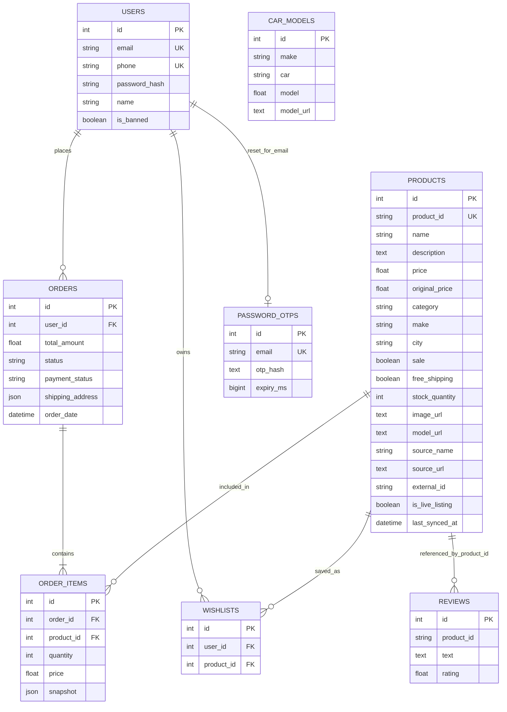

# ER Diagram

Database-level entity relationship view based on the SQLAlchemy models currently in `backend/models`.

```mermaid
erDiagram
    USERS {
        int id PK
        string email UK
        string phone UK
        string password_hash
        string name
        boolean is_banned
    }

    PRODUCTS {
        int id PK
        string product_id UK
        string name
        text description
        float price
        float original_price
        string category
        string make
        string city
        boolean sale
        boolean free_shipping
        int stock_quantity
        text image_url
        text model_url
        string source_name
        text source_url
        string external_id
        boolean is_live_listing
        datetime last_synced_at
    }

    ORDERS {
        int id PK
        int user_id FK
        float total_amount
        string status
        string payment_status
        json shipping_address
        datetime order_date
    }

    ORDER_ITEMS {
        int id PK
        int order_id FK
        int product_id FK
        int quantity
        float price
        json snapshot
    }

    REVIEWS {
        int id PK
        string product_id
        text text
        float rating
    }

    CAR_MODELS {
        int id PK
        string make
        string car
        float model
        text model_url
    }

    PASSWORD_OTPS {
        int id PK
        string email UK
        text otp_hash
        bigint expiry_ms
    }

    WISHLISTS {
        int id PK
        int user_id FK
        int product_id FK
    }

    USERS ||--o{ ORDERS : places
    ORDERS ||--|{ ORDER_ITEMS : contains
    PRODUCTS ||--o{ ORDER_ITEMS : included_in
    USERS ||--o{ WISHLISTS : owns
    PRODUCTS ||--o{ WISHLISTS : saved_as
    USERS ||--o| PASSWORD_OTPS : reset_for_email
    PRODUCTS ||--o{ REVIEWS : referenced_by_product_id
```
