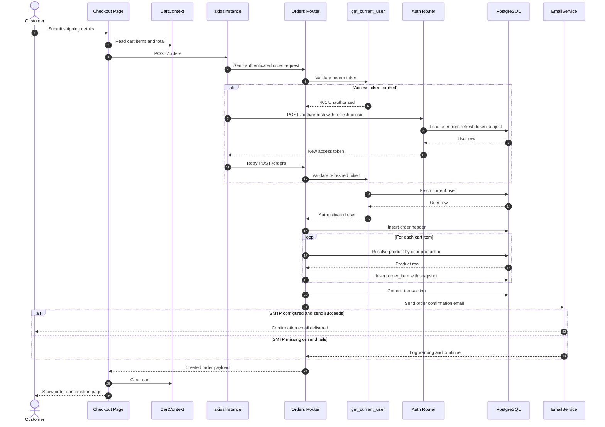

# Sequence Diagram

Primary checkout and order-confirmation flow, including token refresh and best-effort email delivery.

```mermaid
sequenceDiagram
    autonumber
    actor Customer
    participant Checkout as Checkout Page
    participant Cart as CartContext
    participant Axios as axiosInstance
    participant OrdersAPI as Orders Router
    participant Guard as get_current_user
    participant AuthAPI as Auth Router
    participant DB as PostgreSQL
    participant Mail as EmailService

    Customer->>Checkout: Submit shipping details
    Checkout->>Cart: Read cart items and total
    Checkout->>Axios: POST /orders
    Axios->>OrdersAPI: Send authenticated order request
    OrdersAPI->>Guard: Validate bearer token

    alt Access token expired
        Guard-->>OrdersAPI: 401 Unauthorized
        Axios->>AuthAPI: POST /auth/refresh with refresh cookie
        AuthAPI->>DB: Load user from refresh token subject
        DB-->>AuthAPI: User row
        AuthAPI-->>Axios: New access token
        Axios->>OrdersAPI: Retry POST /orders
        OrdersAPI->>Guard: Validate refreshed token
    end

    Guard->>DB: Fetch current user
    DB-->>Guard: User row
    Guard-->>OrdersAPI: Authenticated user
    OrdersAPI->>DB: Insert order header

    loop For each cart item
        OrdersAPI->>DB: Resolve product by id or product_id
        DB-->>OrdersAPI: Product row
        OrdersAPI->>DB: Insert order_item with snapshot
    end

    OrdersAPI->>DB: Commit transaction
    OrdersAPI->>Mail: Send order confirmation email

    alt SMTP configured and send succeeds
        Mail-->>Customer: Confirmation email delivered
    else SMTP missing or send fails
        Mail-->>OrdersAPI: Log warning and continue
    end

    OrdersAPI-->>Checkout: Created order payload
    Checkout->>Cart: Clear cart
    Checkout-->>Customer: Show order confirmation page
```
