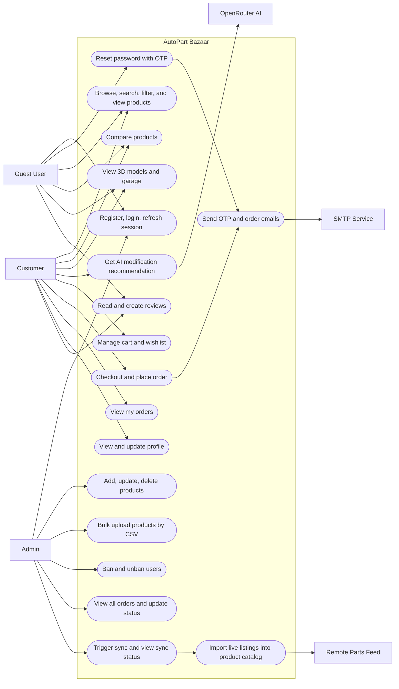

# Use Case Diagram

Main user and admin capabilities exposed by the current AutoPart Bazaar application.

```mermaid
flowchart LR
    Guest[Guest User]
    Customer[Customer]
    Admin[Admin]
    SMTP[SMTP Service]
    AI[OpenRouter AI]
    Feed[Remote Parts Feed]

    subgraph System["AutoPart Bazaar"]
        UCAuth([Register, login, refresh session])
        UCReset([Reset password with OTP])
        UCBrowse([Browse, search, filter, and view products])
        UCCompare([Compare products])
        UCGarage([View 3D models and garage])
        UCAI([Get AI modification recommendation])
        UCCart([Manage cart and wishlist])
        UCCheckout([Checkout and place order])
        UCOrders([View my orders])
        UCProfile([View and update profile])
        UCReview([Read and create reviews])
        UCAdminProducts([Add, update, delete products])
        UCBulk([Bulk upload products by CSV])
        UCUsers([Ban and unban users])
        UCAdminOrders([View all orders and update status])
        UCSync([Trigger sync and view sync status])
        UCLive([Import live listings into product catalog])
        UCEmail([Send OTP and order emails])
    end

    Guest --> UCAuth
    Guest --> UCReset
    Guest --> UCBrowse
    Guest --> UCCompare
    Guest --> UCGarage
    Guest --> UCReview

    Customer --> UCBrowse
    Customer --> UCCompare
    Customer --> UCGarage
    Customer --> UCAI
    Customer --> UCCart
    Customer --> UCCheckout
    Customer --> UCOrders
    Customer --> UCProfile
    Customer --> UCReview

    Admin --> UCAuth
    Admin --> UCAdminProducts
    Admin --> UCBulk
    Admin --> UCUsers
    Admin --> UCAdminOrders
    Admin --> UCSync

    UCCheckout --> UCEmail
    UCReset --> UCEmail
    UCAI --> AI
    UCSync --> UCLive
    UCLive --> Feed
    UCEmail --> SMTP
```
